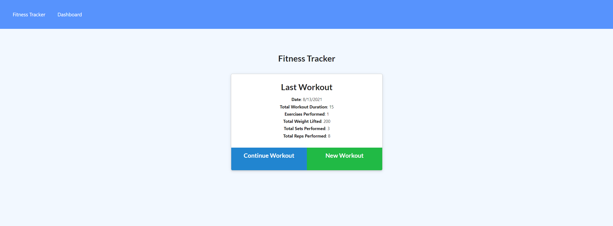
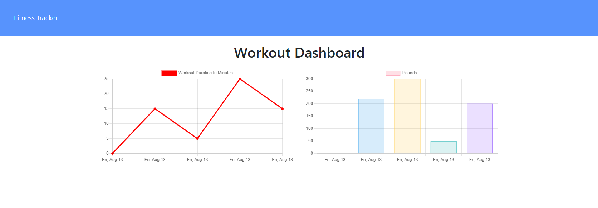

# Workout Tracker

## Table of Contents

- [Description](#description)
- [Usage](#usage)
- [Screenshot](#screenshots-of-working-application)
- [License](#license)
- [Credits](#credits)
- [Questions](#questions)

## Description

This application is a website where you can track your workouts. The application allows the user to add a workout, select the exercise type, and enter specific information based on their workout. The user can also add another workout to their existing workout if for instance they did resistance training and then cardio afterwards. The application also displays the user's workout history in the form of two separate charts. This application uses the Node and the Express module for setting up the server, the Mongoose module for connecting to the MongoDB database, and the Morgan module as a middleware HTML request logger.

Link to Deployed Application: [https://enigmatic-plains-49824.herokuapp.com/](https://enigmatic-plains-49824.herokuapp.com/)

## Usage

To use this application, the user would navigate to the deployed Heroku website and click on the green Add New Workout button. Then, the user would select their exercise type, either resistance or cardio. Depending on which they choose, they are then prompted to enter specifics of their workout such as the name of the exercise, the duration, the distance, or how many reps, sets, and the weight. After they have entered that information, they can click the Add Exercise button and then the Complete button to have their workout added. If the user wants to continue their workout, they can click the Continue Workout button and add another exercise that they did. Once they are done entering their workout, the user can navigate to the Dashboard to see their workouts being logged and tracked in the form of charts. The charts display their workout history from the past 7 workouts. Finally, the user will be displayed with a line chart to show the total duration of each workout as well as a bar chart to display the total weight of each workout.

### Screenshots of Working Application

## License

This project is licensed under the [MIT License](https://opensource.org/licenses/MIT).

## Credits

This application was an assignment for the GA Tech Full Stack Web Development Coding Bootcamp. The starter code that was provided for this assignment is located in the public folder. All other files were created and coded on my own.

## Questions

If you have any questions about the repo, open an issue or contact me directly:

- Please contact me directly at my [GitHub](https://github.com/mcall0147)
- Or contact me by email at [mcallahanx93@gmail.com](mailto:mcallahanx93@gmail.com)
